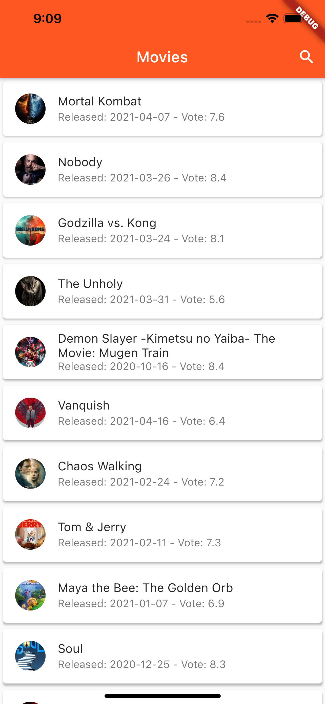
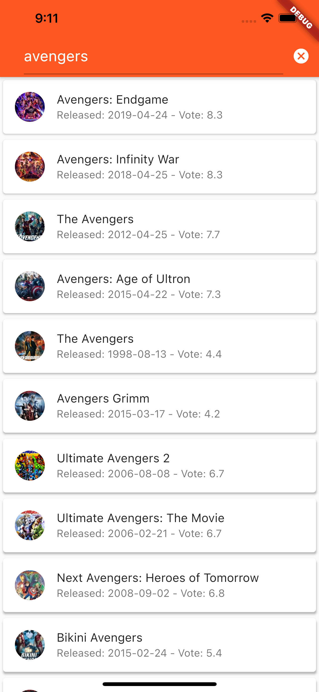
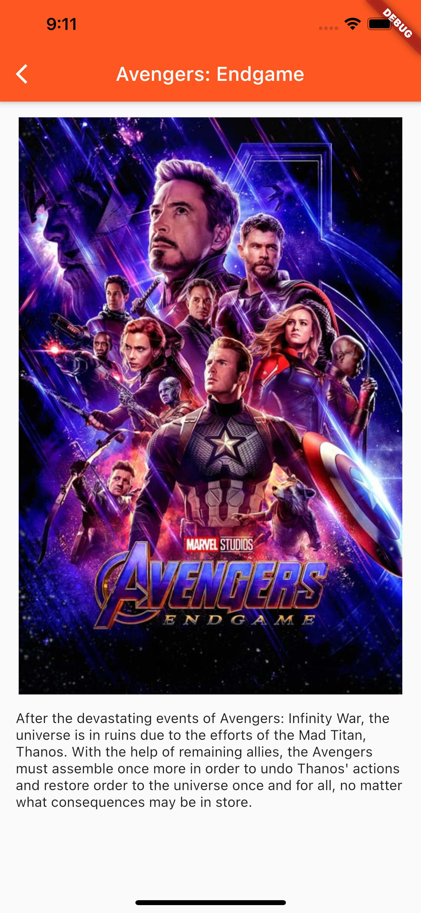

# Filmophilia

Another project using TMDB API, but like the description said... i'll add the option to play movies to this app.
So ya.. this is a v0.1 version [LOL]

For more detail about updated feature, go to [release page](https://github.com/ufebri/filmophilia/releases).

## Getting Started

This project using [flutter_dotenv](https://pub.dev/packages/flutter_dotenv), make sure to add your api key to file .env

## Screenshot
  
